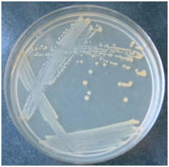

### Materials Required:
1.	Mixed culture of bacteria.
2.	Sterile petri dish with appropriate bacterial media(such as trypticase soy agar, nutrient agar).
3.	Inoculating loop (usually nichrome, a nickel-chromium alloy, or platinum; it may also be a single-use disposable plastic loop, which would be discarded between sectors rather than resterilized).
4.	Bunsen burner.
5.	Marking pen.
 
### Procedure:
All the process is done in a laminar air flow cabinet aseptically.
 
#### Label a Petri dish:
Petri dishes are labelled on the bottom rather than on the lid. Write close to the edge of the bottom of the plate to preserve area to observe the plate after it has incubated. Labels usually include the organism name, type of agar, date, and the plater's name or initials. Using sterile cotton swabs, remove any visible water on the agar in the plate or around the inner rim of the petri plate. Observe the plate and mentally divide it into three sectors. The plate will then be turned clockwise (if you are right handed) with the agar side up. The second sector will then be at the top for streaking and then the plate is turned again so that the third sector can be streaked.
 
#### Sterilize the Transfer Loop before Obtaining a Specimen:
To streak a specimen from a culture tube, metal transfer loops are first sterilized by flaming the wire loop held in the light blue area of a Bunsen burner just above the tip of inner flame of the flame until it is red-hot. If a hot incinerator is available, the loop may be sterilized by holding it inside the incinerator for 5 to 7 seconds. Once sterile, the loop is allowed to cool by holding it still. Do not wave it around to cool it or blow on it. When manipulating bacteria, transfer loops are usually held like a pencil. If plastic disposable loops are being utilized, they are removed from the packaging to avoid contamination and after being used, are discarded into an appropriate container. A new loop is recommended for each sector of an isolation streak plate.
 
#### Open the culture tube and collect a sample of specimen using the sterile loop:
Isolation can be obtained from any of a variety of specimens. This protocol describes the use of a mixed broth culture, where the culture contains several different bacterial species or strains. The specimen streaked on a plate could come in a variety of forms, such as solid samples, liquid samples, and cotton or foam swabs. Material containing possibly infectious agents should be handled appropriately in the lab using bio safety procedure.

#### Remove the test tube cap. 
It is recommended that the cap be kept in your right hand (the hand holding the sterile loop). Curl the little finger of your right hand around the cap to hold it or hold it between the little finger and third finger from the back. Modern test tube caps extend over the top of the test tube, keeping the rim of the test tube sterile while the rim of the cap has not been exposed to the bacteria. The cap can also be placed on the disinfected table, if the test tube is held at an angle so that air contamination does not fall down into the tube. Insert the loop into the culture tube and remove a loopful of broth. Replace the cap of the test tube and put it back into the test tube rack.
 
#### Streak the Plate:
The lid of the agar plate has to be opened just sufficiently enough to streak the plate with the inoculation loop. Minimize the amount of agar and the length of time the agar is exposed to the environment during the streak process.
 
##### Three Sector Streak (t streak):
1.	Sterilize the wire loop.
2.	Cool the loop by touching it on the edge of the sterile agar plate.
3.	Dip the loop into the broth culture containing the mixture of bacteria.
4.	Lift the lid of the plate just enough to insert the loop. Drag the loop over the surface of the top one-third of the plate back and forth in a "zig-zag" formation.
5.	The loop has picked up thousands of bacteria which are spread out over the surface of the agar.
6.	Sterilize the loop in the flame.
7.	Turn the plate 90 degrees and drag the loop through the area you have just streaked two to three times and continue to drag the loop in a "zig-zag" formation in the remaining half of the plate without touching that area again.
8.	Sterilize the loop in the flame.
9.	Turn the plate 90 degrees. Repeat the procedure. Drag the loop two to three times through the area you just streaked, and fill in the remaining area of the plate (zig-zag formation), being very careful not to touch any of the areas you previously streaked.
10.	Incubate the plate for 24 hours. If you streaked correctly, you will see isolated colonies in the third sector. The heaviest growth will be in the first sector. There will be less growth and some isolated colonies in the second sector. The third area should have the least growth with isolated colonies.

##### Four Quadrant Streak :
1.	Loosen the cap of the bottle containing the inoculum.
2.	Hold an inoculation loop in your right hand.
3.	Flame the loop and allow it to cool.
4.	Lift the test tube containing the inoculum with your left hand.
5.	Remove the cap/ cotton wool plug of the test tube with the little finger of your right hand.
6.	Flame the neck of the test tube.
7.	Insert the loop into the culture broth and withdraw. At all times hold the loop as still as possible.
8.	Flame the neck of the test tube again.
9.	Replace the cap/ cotton wool plug of the test tube using the little finger of your right hand. Place the test tube in a rack. For a liquid culture, dip the loop into the broth, or for solid media, lightly touch a colony with the loop.
10.	Partially lift the lid of the Petri dish containing the solid medium.
11.	Place a loopful of the culture on the agar surface on the area 1. Flame the loop and cool it for 5 seconds by touching an unused part of the agar surface close to the periphery of the plate, and then drag it rapidly several times across the surface of area1.
12.	Remove the loop and close the Petri dish.
13.	Reflame and cool the loop, and turn the petri dish 90°C then touch the loop to a corner of the culture in area1 and drag it several times across the agar in area 2, hitting the original streak a few times. The loop should never enter area 1 again.
14.	Remove the loop and close the Petri dish.
15.	Reflame and cool the loop and again turn the dish 90°C anticlockwise. streak area 3 in the same manner as area 2, hitting last area several times.
16.	Remove the loop and close the Petri dish.
17.	Flame the loop, again turn the dish 90°C and then drag the culture from a corner of a area3 across area 4, contacting area 3 several times and drag out the culture as illustrated. Using a wider streak. Do not let the loop touch any of the previously streaked areas. The flaming of the loop at the points indicated is to effect the dilution of the culture so that fewer organisms are streaked in each area, resulting in the final desired separation.
18.	Remove the loop and close the Petri dish.
19.	Tape the plate closed and incubates the plate in an inverted position in an incubator for 24-48 hours.
20.	Flame the loop before putting it aside.      

&nbsp;

Fig 1: Staphylococcus aureus colony on nutrient agar

1. Area of initial inoculation and the first streak yields heavy growth.
2. Area of the second streak from the area 1 yields gives dense growth.
3. Area of the third streak from the area2 yields weak growth.
4. Area of the fourth streak from the area3 yields single colonies.

&nbsp;

### Differences Encountered in a Real laboratory:
 
In an actual laboratory setting, there are certain important steps that are not necessarily applicable in a virtual lab:
 
1.	Always wear gloves, and lab coat.
2.	Tie your hair properly to prevent any contamination from the culture you are working with.
3.	When you enter the lab switch on the exhaust fans.
4.	Switch on the lights of the laminar air flow and blower. Prepare your work space (Laminar Air Flow Cabinet) or lab bench by wiping down the area with disinfectant.
5.	Properly adjust the flame of the Bunsen burner. The proper flame is a small blue cone; it is not a large plume, nor is it orange.
6.	Always label all tubes and plates with:

a. The name of the organism

b. The type of media 

c. Your initials 

d. The date

7.	While flaming the inoculation loop be sure that each segment of metal glows orange/red-hot before you move the next segment into the flame.
8.	Once you have flamed your loop, do not lay it down, blow on it, touch it with your fingers, or touch it to any surface other than your inoculums. If you do touch the tip to another surface or blow on it, you will have to re-flame the loop before you proceed to your experiment.
9.	Allow your loop to cool before you try to pick up your organism to avoid killing the inoculum.
10.	When removing the caps from tubes, always keep the caps in your hand.  Never set them on the table, as they could pick up contaminants. 
11.	Always handle open tubes at an angle near to the flame of the burner; never let them point directly up, since airborne or other environmental organisms could fall into the tube and cause contamination.
12.	Open the lid of the plate sufficiently (45 degrees) to introduce an inoculation loop and only for the time it takes to obtain inoculums.
13.	Rotate the plate counter clockwise 90 degrees and cross the prior streaks to pick up some bacteria and spread them into the next quadrant (Repeat in all the four quadrants).
14.	Streak gently; does not gouge the agar.
15.	As soon as the inoculation is completed, flame your loop or needle. Never place a contaminated tool on your workbench.
16.	Turn the inoculated petriplate upside down while keeping it in the incubator.
17.	Discard all contaminated materials properly and return your supplies to the proper storage locations, and clean up your working area.
18.	Always disinfect your work area when you are finished.
19.	Turn off Bunsen burner and make sure that the safety valve of the gas cylinder is tightened.
20.	Switch off the laminar air flow and exhaust fans before leaving the laboratory.
21.	Ensure proper hand washing before you leave from the laboratory.

